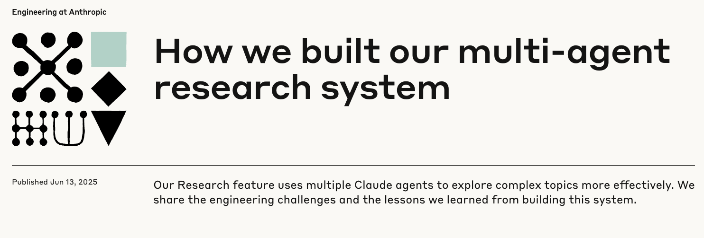
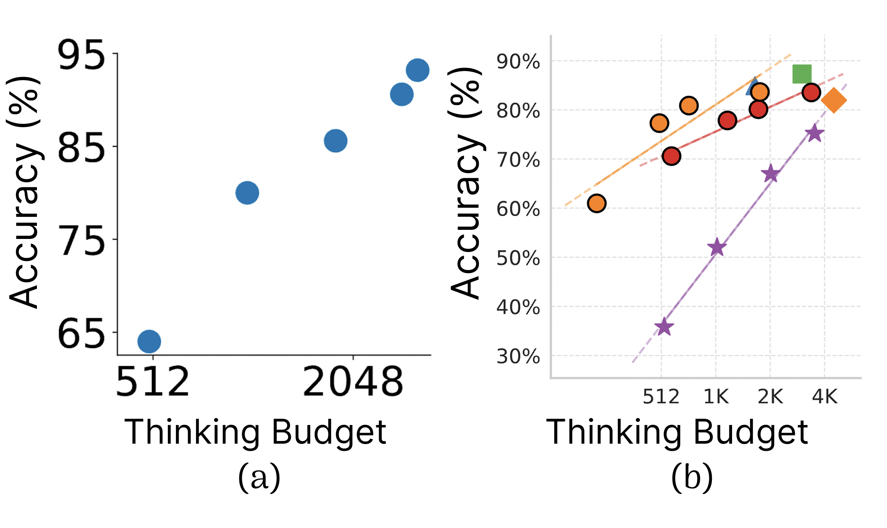

# Multi-Agent AI Applications

## When to Use What: AI Workflows vs Single Agent vs Multi-Agent

Before building any AI system, it's crucial to understand when and when not to use multi-agents. **Generally, it's always best to implement the simplest solution possible to solve a problem.**

### Decision Framework

#### 1. **AI Workflows** (Recommended Starting Point)
**Use when:** The problem can be solved with a well-defined set of steps that you can hardcode.

**Benefits:**
- **Fastest path to getting results**
- **Easiest to implement, debug, manage, and optimize**
- **Most deterministic and repeatable** - crucial for production systems reliability

#### 2. **Single AI Agent**
**Use when:** The problem is open-ended where it's difficult to know beforehand the steps required to solve it. In other words, you can't hardcode the solution.

#### 3. **Multi-Agent System**
**Use when:** You have an open-ended problem that requires an AI agent, AND the problem is complex enough that performance with a single AI agent starts to bottleneck.

### The Reality Check

For most problems, deterministic AI workflows are often the best solution. They're simpler to build, easier to debug and optimize, and much more reliable. Fewer business problems are better suited for agents, and fewer still require multi-agent. There is a large amount of tech debt involved in building and maintaining agents and multi-agent systems, and often unclear or hard to measure ROI.

Gartner predicts that "over 40% of agentic AI projects will be scrapped by 2027 due to escalating costs and unclear business value" (see [Gartner Report](https://www.reuters.com/business/over-40-agentic-ai-projects-will-be-scrapped-by-2027-gartner-says-2025-06-25/?utm_source=chatgpt.com)). This aligns with Anthropic's internal findings that "agents typically use about 4x more tokens than chat interactions, and multi-agent systems use about 15x more tokens than chats" ([Anthropic's Multi-Agent Research System](https://www.anthropic.com/engineering/multi-agent-research-system)).

Therefore, you should only use them if you have clearly established that a simpler workflow will not work. Despite the technical challenges, there definitely are some problems that are better suited for agents and multi-agent.

[Read the full blog...](https://www.anthropic.com/engineering/multi-agent-research-system)

A fantastic example of a production multi-agent system is Anthropic's [Multi-Agent Research System](https://www.anthropic.com/engineering/multi-agent-research-system). This is a must-read if you want to learn more about building effective multi-agent systems.

Agents and multi-agent systems can be extremely powerful and valuable if applied to the right problems. Many companies are in the process of building agents and/or have plans to build them in the near future (see [State of AI Agents](https://www.langchain.com/stateofaiagents)) with the top use cases being research and summarization. So 2025 has definitely been the year of agents and we should expect 2026 to show increased adoption of multi-agent systems.

## Why Multi-Agent Systems Excel for Complex Problems

When you do have an open-ended problem that requires an AI agent, and the problem is complex enough that performance with a single AI agent starts to bottleneck, multi-agent systems offer several key advantages:

### 1. **Efficiency Through Parallelization**
- **Simultaneous task execution:** Multi-agent systems can perform multiple tasks simultaneously, greatly reducing overall system latency
- **Breadth of coverage:** Parallelization allows you to cover much more ground in a shorter amount of time, exploring multiple angles and perspectives simultaneously

### 2. **Better Context Management**
- **Focused agents:** You can maintain separate context for each agent (system prompts, tools, memory, etc.)
- **Reduced distractions:** Keeps agents better focused on their specific tasks without getting distracted by irrelevant context
- **Improved performance and reliability:** Clean context separation greatly improves both performance and reliability

### 3. **Massively Scale Token Usage → Scale Performance**

- **Context window multiplication:** Since each agent has a separate context window, the number of agents becomes a multiplier for the amount of work that can be done
- **Reasoning token scaling:** We're essentially multiplying the total context and, more importantly, the amount of reasoning tokens of the overall system. Several studies have shown that performance improves with more reasoning tokens (see the paper above).
- **Performance improvement:** This scaling leads to improved overall system performance

### 4. **Modularization and Reusability**
- **Independent optimization:** Each agent can be optimized independently for its specific task
- **Right tool for the job:** Use the right model, tools, prompts, etc. for each specific agent
- **Independent updates:** Update and improve each agent independently without affecting others
- **Cross-application reuse:** Re-use agents across applications (e.g., a highly optimized research agent can be used for content creation, competitor analysis, customer prospecting, etc.)

## Multi-Agent Patterns

Langgraph outlines 4 main [multi-agent patterns](https://langchain-ai.github.io/langgraph/concepts/multi_agent/):

1. Supervisor
    - The supervisor is the main agent that coordinates the work of the other agents.
    - The supervisor is responsible for interacting with the user while sub-agents perform specific tasks for the supervisor but never interact with the user directly.
2. Network
    - Agents interact with each other in a peer-to-peer fashion.
3. Hierarchical
    - Agents are organized in a tree-like structure with a root agent coordinating the work of its children agents, and where the children agents can further coordinate the work of their own children agents, and so on.
4. Custom
    - Agents are connected in arbitrary ways. The connections and interactions between agents are completely custom and are not based on any of the other patterns.
