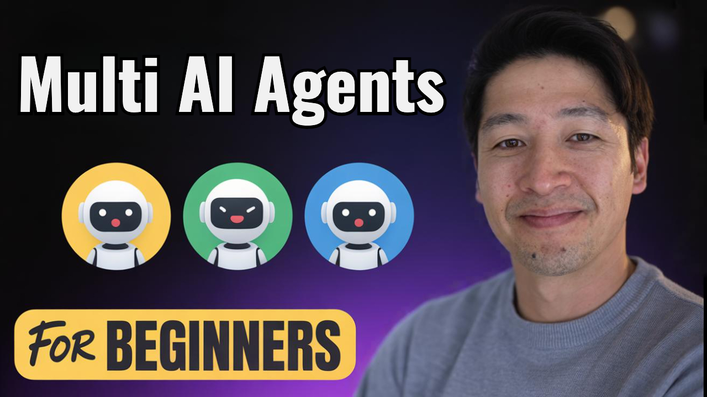
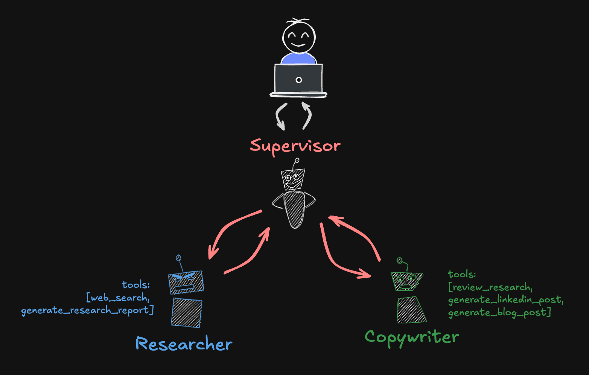

# Multi-Agent Supervisor

## Video

## Getting Started

See the `Getting Started` section in the root [README](../../../../README.md) for step-by-step instructions on how to install the repo and run the projects.

## Supervisor Pattern

This multi-agent example uses a supervisor agent to coordinate the work of multiple sub-agents. The supervisor agent is responsible for interacting with the user and managing the workflow. The sub-agents perform specific tasks delegated by the supervisor, but never interact with the user directly.

The supervisor pattern is well suited for use cases where there are clear handoffs between different agents with specialized capabilities. The supervisor can be thought of as a project manager or program coordinator that oversees the work of multiple agents and ensures that the overall goal is achieved. It's also useful when you have sub-agent workflows that can be ran independently and in parallel.

## Multi-Agents in Langgraph

The beauty of Langgraph is that it's a low-level framework that allows you to build any multi-agent pattern you want. Because of its inherent flexibility, there are multiple ways you can build multi-agent patterns, namely: using subgraphs, or through tool calling. We are going to focus on the subgraph implementation for a few reasons:

1. Tool-calling is covered extensively online as well as in many examples in this repo, like the [effective_agents](../../effective_agents/README.md) module. So it should be more familiar to most people.
2. Subgraphs are a powerful feature of Langgraph that isn't covered as much and I think it's important to understand.
3. Calling agents through tool calling becomes necessary if you have remote graphs that might be served through an MCP or other API.
4. If you're building multi-agents in the same application, sub-graphs give you better control and observability. Tracing with Langsmith for example automatically captures all node and tool executions from all of the sub-graphs.

## Langchain Supervisor Library

Langchain also created a dedicated library for the supervisor pattern. If you're interested in a higher-level implementation of the supervisor pattern, check out the [`langgraph-supervisor-py`](https://github.com/langchain-ai/langgraph-supervisor-py).

However, I think it's important to understand at a lower level how this pattern works so I still recommend starting with the code in this directory.
